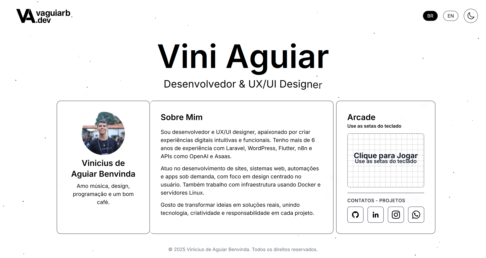

<h1 align="left">👋 Olá, eu sou o Vinicius!</h1>

###

💻 Desenvolvedor FullStack | Laravel • Tailwind• Python   🚀 Criando soluções, adquirindo experiências e transformando ideias em realidade   🌎 Brasília - DF | 📧 viniciusaguiarbenvinda@gmail.com

###

<h2 align="left">🚀Sobre mim</h2>

###

Sou apaixonado por tecnologia, automação e desenvolvimento de software.   Tenho experiência em projetos reais, atuando como FullStack, desde a concepção até o deploy em ambientes produtivos.   Busco sempre melhorar processos e criar programas eficientes e seguros.

###

<h2 align="left">Eu trabalho com</h2>

###

  
  
  
  
  
  
  
  
  
  
  
  
  
  
  
  
  
  
  
  
  
  
  
  
  
  
  

Para uma visualização mais detalhada das minhas competências técnicas e comportamentais, preparei a seguinte apresentação:

**[➡️ Acessar Apresentação de Habilidades no Google Slides](https://docs.google.com/presentation/d/1V80374CVTPotrLjCkGWz4E7LAwPr5pXL8tnc_HG6hJ0/edit?usp=sharing)**

###

<h2 align="left">📜Meus Projetos</h2>

###

Direk → Sistema de Controle do Fluxo de Produção de Marcenarias, gestão de pedidos, automações e controle de funções Tecnologias:  AWS, Laravel, MySQL, Tailwind Link: https://direk.com.br  Automação IQVC, Saúde → Scripts para processar formulários de Controle de Qualidade de Vida e integrar com planilhas dinâmicas Tecnologias: Python, Google API   🔒 Observação: Os projetos são privados por questões comerciais. Caso queira saber mais, entre em contato comigo.

### 

<h2 align="left">📄 Currículo</h2>

Meu currículo completo, com detalhes sobre formação acadêmica, experiências profissionais e certificações, está disponível para visualização e download.

**[➡️ Acessar Currículo em PDF](https://vaguiarb.dev/assets/curriculo.pdf)**

###

<h2 align="left">📬 Contato</h2>

###

🌐 Site Pessoal → https://vaguiarb.dev 💼 LinkedIn → https://linkedin.com/in/vinicius-aguiar000 📧 Email → viniciusaguiarbenvinda@gmail.com

### 

<h2 align="left">💬 Recomendações</h2>

> "Tive o prazer de coordenar o trabalho do Vinicius no projeto de desenvolvimento voluntário para a Comunidade Shalom. Ele demonstrou grande iniciativa e habilidade técnica, liderando o desenvolvimento de nossa plataforma de doações com a integração via API da Asaas. Sua contribuição na automação de processos com Python e no deploy da aplicação com Docker e AWS foi crucial para o sucesso do projeto. O Vinicius é um desenvolvedor proativo, focado em entregar soluções de alta qualidade e com excelente capacidade para resolver problemas complexos. Ele foi um ativo inestimável para nossa equipe e eu o recomendo fortemente para qualquer desafio profissional."
>
> **- Padre Dennys**
>
> *Coordenador de Projetos de TI - Comunidade Católica Shalom*

---

> "Tive o prazer de trabalhar diretamente com o Vinicius no projeto de desenvolvimento voluntário... Sua proatividade e capacidade de aprendizado rápido eram notáveis. Além de suas habilidades técnicas com Docker, Nginx e AWS, o Vinicius sempre demonstrou um grande foco na qualidade do código e na documentação, facilitando a colaboração de toda a equipe. Ele é um desenvolvedor comunicativo, organizado e que não mede esforços para resolver problemas. Recomendo fortemente."
>
> **- Yuri Costa**
>
> *Desenvolvedor Voluntário - Comunidade Católica Shalom*
